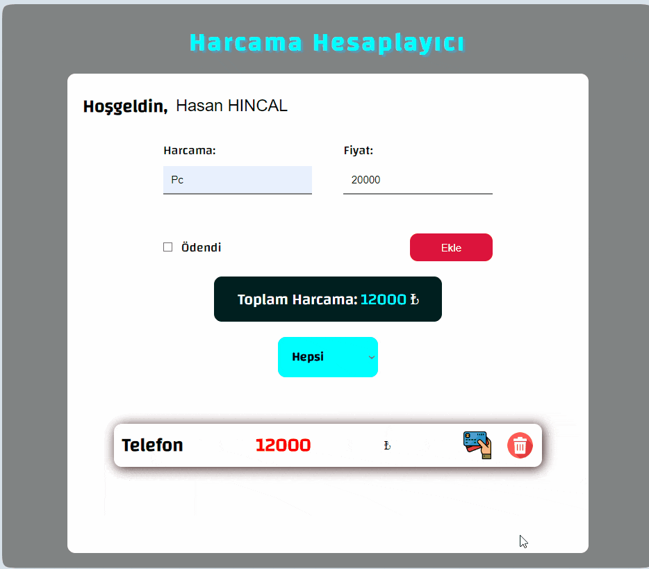

<h1>Spending Calculator Project</h1>

This JavaScript-based expense calculator is designed to help individuals manage their finances more effectively.Users can input their montly income and expenses, catagorize them, and monitor their spending habits over time.
 
<h2>Technologies used in the project</h2>

Codded in HTML5, CSS3 and JS

<h2>Screen Gif</h2>

